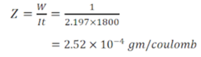

<h3> Procedure of Performing the Simulation</h3>
<ol> 
  <li> As the student will open the simulator then simulator will show semantic diagram of copmlete arrangement of Electrochemical Equivalent (ECE) Of Copper.  </li>
<li> Firstly User will measure the  initial weight of cupper elctrode by using of weighing machine.  </li>
<li> After measure the intial weight of cuppeer electrode, user will put the the cupper electrode inside the Cupper Sulphate Solution to make the close circuit and note the depostion mechanism of ion on Cathode.  </li>
  <li> Now user will select the value of resistor arbitiary, by just moving the slider bar of resistance.  </li>
  <li> After selecting the value of resistor user will ON the switch of circuit.  </li>
  <li> When user will ON the circuit at that time user will also ON the stopwatch to read the value of time.  </li>
  <li> As the user will ON the circuit the ammeter would show the value of current, which will continious vary with time as accordance with depostion rate of ion on copper electrode.  </li>
  <li> After the certain interval of time user will open the circuit by just clicking the switch of the circuit. and same time user will also stop the stopwatch   </li>
  <li> By following above steps user will take the reading of current at their chosen interval of time and also the value of time interwall by the help of stopwatch.  </li>
  <li> Now user will take cupper electrode away from the cupper sulphate solution and again measure the value of weight of cupper electrode by the help of weighing machine and note down the final weight of cupper electrode. Here the final weight of cupper electrode refer to the weight of cupper after the process of deposition process which has been done by using electrolysis.  </li>
  <li> Any way user can get all the value namely time ,current at that time ,initial weight and final weight of cupper electrode (quantity of deposited ion). </li>
  <li> User will fill these value inside the table and can get the calculated value elechemical equivalent (ECE)of copper. </li>
  <li> Following table is to be filled for calculating the value ECE of Cupper. which can be filled by following above steps.  </li>
  
  Sr. No |	Initial weight(W1)	| Final Weight (W2)  | Deposited weight of Ion (W2-W1) | Current  | Time interval | Electrochemical Equivalent (ECE)of Cupper (Z)
:--|:--|:-- |:-- |:-- |:--  |:-:
1.|      |      |   
2.|      |      |   
</ol>
<h3> Calculation </h3>

<h4> Suppose obtained data are </h4> 
Initial mass of the cathode, W1 = 27.6 gm 
Final mass of the cathode, W2 = 28.6 gm 
Mass of copper deposited, W = (W2 – W1) = (28.6 - 27.6) = 1 gm 
B. Data for finding equivalent weight of cupper 
Time for required current pass, t = 1800 sec 
Mean current, I = 2.197 amp  

 Calculation of ECE of cupper can be understand by following expresssion 
  

