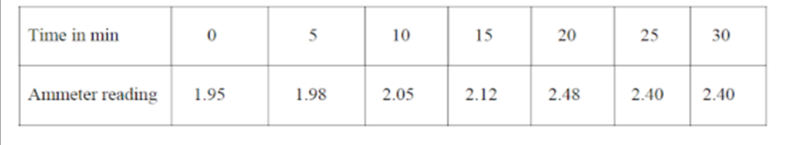

<h2><b>Electrochemical equivalent:</b></h2>
An electrochemical equivalent (ECE) is the amount of a substance in grams produced or consumed by the passage of one coulomb of electricity in an electrochemical reaction.voltmeter is used to measure the electrochemical equivalent of an element. ECE is mainly used for determining the kinetics of corrosion rates and to estimate the oxidizing power in specific environments. Electrochemical equivalent can be abbreviated as Eq (grams per coulomb).  
Faraday’s first law of electrolysis states that, the amount of substance liberated at an electrode is directly proportional to the quantity of electricity passed. 

or, W ∞ Q
 
Where, 
W = amount of substance liberated in gram. 
Q = quantity of electricity passed in coulomb.
 
Since, Q = I.t
 
Where,
I = Current in ampere and
t = time in seconds
 
Hence, 
    W∞I.t  or W = ZI.t = ZQ … … … … … … … … … … … … … … … (1) 

Where, Z = Proportionality constant, called electrochemical equivalent. 
Where 
                V=Voltage across the standard resistor  
If I = 1 ampere and t = 1 second then Z = W Therefore electrochemical equivalent may be defined as, “The mass of substance (in grams) liberated at the electrode on passing current of 1 ampere for 1 second or on passing 1 coulomb of electricity is called electrochemical equivalent of the substance”.
From equation (1),

Knowing, W, I & t, Z can be determined 
 

 
Electrochemical equivalent of some elements are : 
Silver    -	0.0011181 
Copper	  - 0.0003281 
Hydrogen	- 0.0000104
 
Data for determining the ammeter reading with time
  

<h1>calculation</h1> 
Mass of copper deposited  
Initial mass of the cathode, W1 = 27.6 gm 
Final mass of the cathode, W2 = 28.6 gm 
Mass of copper deposited, W = (W2 – W1) = (28.6 - 27.6) = 1 gm 
Data finding for equivalent of cupper 
Time for required current pass, t = 1800 sec 
Mean current, I = 2.197 amp
